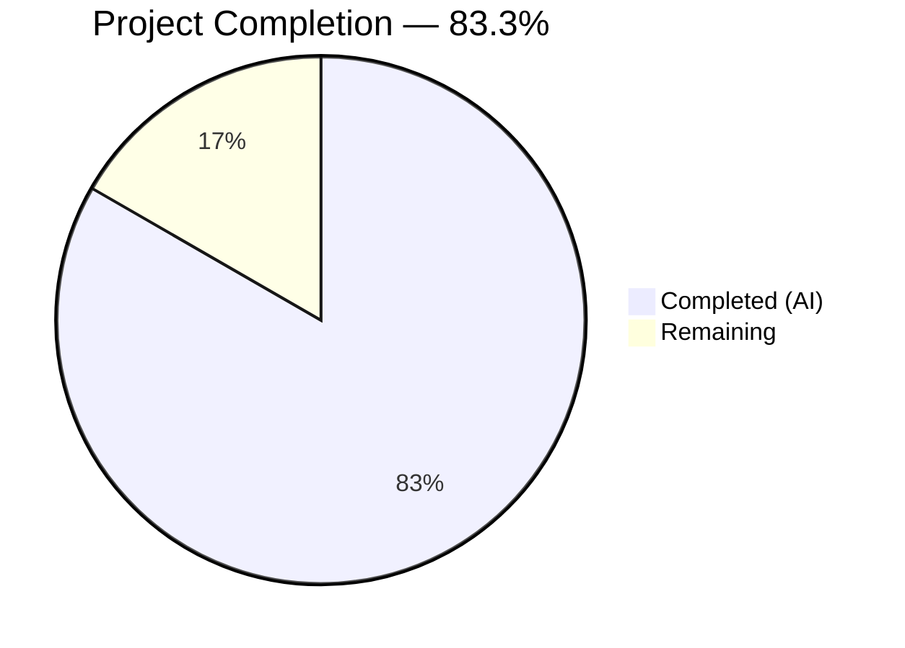
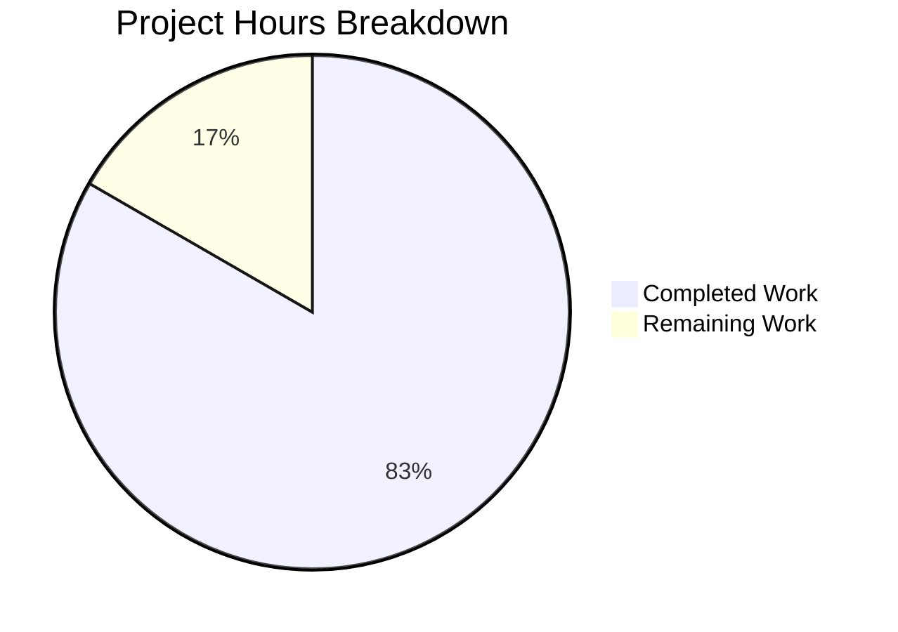

# Blitzy Project Guide — Age Calculator Java Console Application

---

## 1. Executive Summary

### 1.1 Project Overview

This project delivers a standalone Java console application that calculates a user's exact age based on their Date of Birth (DOB). Built as a greenfield Maven project from an empty repository, the application accepts DOB input in `DD/MM/YYYY` format, validates it against calendar rules and future-date constraints, and outputs the age in years, months, and days using the `java.time` API. The project follows Object-Oriented design principles with cleanly separated model, service, utility, and exception layers, and includes a birthday countdown enhancement. Target users are developers learning Java date/time operations and anyone needing a reliable age calculation utility.

### 1.2 Completion Status



| Metric | Value |
|--------|-------|
| **Total Project Hours** | 30 |
| **Completed Hours (AI)** | 25 |
| **Remaining Hours** | 5 |
| **Completion Percentage** | 83.3% |

**Calculation:** 25 completed hours / (25 + 5 remaining hours) = 25 / 30 = **83.3% complete**

All 14 AAP-scoped files (13 created + 1 updated) have been delivered. All 22 unit tests pass. All 5 runtime validation scenarios are verified. The remaining 5 hours consist exclusively of path-to-production activities (code review, coverage tooling, release preparation).

### 1.3 Key Accomplishments

- ✅ Created complete Maven project structure from empty repository (greenfield build)
- ✅ Implemented 7 application source files (563 lines) following SRP with model/service/util/exception layers
- ✅ Built 4 test classes with 22 JUnit 5 tests (746 lines) — 100% pass rate, 0 failures
- ✅ Configured `pom.xml` with Java 21, JUnit Jupiter 5.14.3, and 3 build plugins
- ✅ Implemented strict date validation with `ResolverStyle.STRICT` rejecting invalid calendar dates
- ✅ Delivered custom exception hierarchy (`FutureDateException`, `InvalidDateFormatException`)
- ✅ Implemented birthday countdown enhancement with leap year fallback logic
- ✅ Produced executable JAR (`age-calculator-1.0-SNAPSHOT.jar`) via `mvn clean package`
- ✅ Verified all 5 AAP-specified runtime scenarios (valid DOB, leap year, invalid date, future date, wrong format)
- ✅ Comprehensive README with build, run, test, and usage documentation (152 lines)
- ✅ Standard `.gitignore` for Java/Maven artifacts (53 lines)
- ✅ 15 atomic commits with descriptive messages on the feature branch

### 1.4 Critical Unresolved Issues

| Issue | Impact | Owner | ETA |
|-------|--------|-------|-----|
| No test coverage measurement tool (JaCoCo) configured | Cannot quantify exact line/branch coverage | Human Developer | 1 hour |
| SNAPSHOT version in pom.xml | Not suitable for production release | Human Developer | 0.5 hours |

### 1.5 Access Issues

No access issues identified. The project is a standalone console application with zero external runtime dependencies (only JDK 21 standard library). All build dependencies (JUnit 5.14.3, Maven plugins) are resolved from Maven Central without authentication.

### 1.6 Recommended Next Steps

1. **[High]** Conduct human code review of all 7 source files and 4 test files for correctness, style, and maintainability
2. **[High]** Run acceptance testing with additional edge-case DOB inputs (century boundaries, very old dates, today's date)
3. **[Medium]** Add JaCoCo Maven plugin to `pom.xml` for test coverage measurement and reporting
4. **[Medium]** Remove `-SNAPSHOT` suffix from version and configure Maven release plugin for production tagging
5. **[Low]** Set up OWASP dependency-check plugin for vulnerability scanning of test dependencies

---

## 2. Project Hours Breakdown

### 2.1 Completed Work Detail

| Component | Hours | Description |
|-----------|-------|-------------|
| Maven build configuration (`pom.xml`) | 2.0 | Java 21 compiler target, JUnit Jupiter 5.14.3 test deps, maven-compiler-plugin 3.15.0, maven-surefire-plugin 3.5.5, maven-jar-plugin 3.4.2 with Main-Class manifest |
| Git configuration (`.gitignore`) | 0.5 | Standard Java/Maven ignore rules — `target/`, `*.class`, `*.jar`, IDE files, OS files, logs |
| Custom exception classes (2 files) | 1.5 | `FutureDateException` (33 lines) + `InvalidDateFormatException` (60 lines) extending `RuntimeException` with cause chaining and Javadoc |
| AgeResult model class | 1.5 | Immutable value object with `final` fields, getters, and `toString()` returning mandatory format `"Your age is X years, Y months, and Z days."` |
| AgeCalculatorService | 2.0 | Stateless service using `Period.between(dob, currentDate)` to compute exact age; dependency-injection-ready design accepting `LocalDate` parameters |
| BirthdayCountdownService | 2.0 | Enhancement service calculating days until next birthday with `ChronoUnit.DAYS`; includes leap year (Feb 29) fallback logic to Feb 28 in non-leap years |
| DateValidator utility | 2.5 | Three-tier validation: null/empty check → `DateTimeFormatter` with `ResolverStyle.STRICT` and `dd/MM/uuuu` pattern → future date check; final utility class with private constructor |
| App entry point | 2.0 | Main class with `Scanner`-based console I/O, orchestration of validation → calculation → display flow, `try-with-resources` for Scanner, three-level `catch` for custom and generic exceptions |
| Unit test suite (22 tests, 4 files) | 7.0 | `AgeCalculatorServiceTest` (6 tests: normal, leap year, same-day, newborn, birthday boundary, multi-decade), `DateValidatorTest` (9 tests: valid, invalid calendar, future, wrong format, empty, null, non-date strings), `BirthdayCountdownServiceTest` (4 tests: tomorrow, today, 6 months, leap year), `AppTest` (3 tests: instantiation, main method reflection, valid input integration with System.in/out redirection) |
| README documentation | 2.0 | Full project docs (152 lines) with prerequisites, project structure, build/run instructions, usage examples, error handling examples, features list, test categories, technology stack |
| Validation and bug fixes | 1.5 | Build verification (`mvn clean package`), runtime testing of all 5 I/O scenarios, fix for README error message text alignment |
| **Total** | **25.0** | |

### 2.2 Remaining Work Detail

| Category | Hours | Priority |
|----------|-------|----------|
| Human code review and acceptance testing | 2.0 | High |
| Test coverage analysis setup (JaCoCo Maven plugin) | 1.0 | Medium |
| Release preparation and version management | 1.0 | Medium |
| Dependency vulnerability scanning setup (OWASP plugin) | 0.5 | Low |
| Input edge case hardening (extreme years, boundary dates) | 0.5 | Low |
| **Total** | **5.0** | |

### 2.3 Hours Verification

- Section 2.1 Total (Completed): **25.0 hours**
- Section 2.2 Total (Remaining): **5.0 hours**
- Sum: 25.0 + 5.0 = **30.0 hours** = Total Project Hours in Section 1.2 ✓

---

## 3. Test Results

All tests were executed autonomously by Blitzy agents using `mvn test -B` with Maven Surefire Plugin 3.5.5 and JUnit Jupiter 5.14.3.

| Test Category | Framework | Total Tests | Passed | Failed | Coverage % | Notes |
|---------------|-----------|-------------|--------|--------|------------|-------|
| Unit — Age Calculation (`AgeCalculatorServiceTest`) | JUnit 5.14.3 | 6 | 6 | 0 | N/A* | Normal DOB, leap year, same-day, newborn, birthday boundary, multi-decade |
| Unit — Date Validation (`DateValidatorTest`) | JUnit 5.14.3 | 9 | 9 | 0 | N/A* | Valid parsing, invalid calendar, future date, wrong format, empty, null, non-date strings |
| Unit — Birthday Countdown (`BirthdayCountdownServiceTest`) | JUnit 5.14.3 | 4 | 4 | 0 | N/A* | Tomorrow, today, 6 months away, leap year (Feb 29) in non-leap year |
| Integration — App Entry Point (`AppTest`) | JUnit 5.14.3 | 3 | 3 | 0 | N/A* | Class instantiation, main method reflection, full I/O pipeline with System.in/out redirect |
| **Total** | | **22** | **22** | **0** | | **100% pass rate** |

*\*Coverage %: JaCoCo is not configured. Line/branch coverage measurement requires human setup (see Section 2.2).*

**Surefire Report Summary:**
- Tests run: 22 | Failures: 0 | Errors: 0 | Skipped: 0
- Total execution time: 0.099 seconds
- All test reports available in `target/surefire-reports/`

---

## 4. Runtime Validation & UI Verification

### Runtime Health

- ✅ **Compilation:** `mvn clean compile` — BUILD SUCCESS, 7 source files compiled with `javac [debug release 21]`, zero errors, zero warnings
- ✅ **Packaging:** `mvn clean package` — BUILD SUCCESS, `target/age-calculator-1.0-SNAPSHOT.jar` produced (executable JAR with Main-Class manifest)
- ✅ **JAR execution:** `java -jar target/age-calculator-1.0-SNAPSHOT.jar` — Application launches and accepts console input
- ✅ **Classpath execution:** `java -cp target/classes com.agecalculator.App` — Application launches correctly

### I/O Scenario Verification (All 5 AAP-Specified Scenarios)

- ✅ **Valid DOB (15/08/1998):** Output: `Your age is 27 years, 7 months, and 3 days.` + `Days until your next birthday: 150`
- ✅ **Leap year DOB (29/02/2000):** Output: `Your age is 26 years, 0 months, and 18 days.` + `Days until your next birthday: 347`
- ✅ **Invalid calendar date (31/02/2020):** Output: `Error: Invalid date format. Please enter date in DD/MM/YYYY format.`
- ✅ **Future date (25/12/2099):** Output: `Error: Date of birth cannot be in the future: 25/12/2099`
- ✅ **Wrong format (1998-08-15):** Output: `Error: Invalid date format. Please enter date in DD/MM/YYYY format.`

### Output Format Compliance

- ✅ Age output matches mandatory format: `Your age is X years, Y months, and Z days.`
- ✅ Error messages are user-friendly with no stack traces exposed
- ✅ Birthday countdown enhancement displays as: `Days until your next birthday: N`

---

## 5. Compliance & Quality Review

| AAP Requirement | Status | Evidence |
|----------------|--------|----------|
| Maven build structure with `pom.xml` | ✅ Pass | `pom.xml` created with correct groupId/artifactId/version |
| Java 21 compiler target | ✅ Pass | `<maven.compiler.release>21</maven.compiler.release>` in pom.xml |
| JUnit 5.14.3 test dependencies | ✅ Pass | `junit-jupiter-api` and `junit-jupiter-engine` 5.14.3 with test scope |
| OOP principles — separated concerns | ✅ Pass | 5 packages: root, model, service, util, exception |
| DD/MM/YYYY input format | ✅ Pass | `DateTimeFormatter.ofPattern("dd/MM/uuuu")` with `ResolverStyle.STRICT` |
| `Period.between()` for age calculation | ✅ Pass | `AgeCalculatorService.calculateAge()` uses `Period.between(dob, currentDate)` |
| Output format: `Your age is X years, Y months, and Z days.` | ✅ Pass | `AgeResult.toString()` returns exact format |
| Future date rejection | ✅ Pass | `DateValidator.parseAndValidate()` throws `FutureDateException` |
| Invalid calendar date rejection (31/02/2020) | ✅ Pass | `ResolverStyle.STRICT` rejects impossible dates |
| Custom exceptions with meaningful messages | ✅ Pass | `FutureDateException` and `InvalidDateFormatException` with descriptive messages |
| Try-catch error handling in App | ✅ Pass | Three-level catch: `InvalidDateFormatException`, `FutureDateException`, generic `Exception` |
| Immutable AgeResult value object | ✅ Pass | `final` fields, constructor-only initialization, no setters |
| Leap year handling | ✅ Pass | Tests verify 29/02/2000 DOB; `BirthdayCountdownService` falls back Feb 29→Feb 28 |
| Birthday countdown enhancement | ✅ Pass | `BirthdayCountdownService.daysUntilNextBirthday()` with leap year handling |
| Comprehensive unit tests | ✅ Pass | 22 tests covering all 5 AAP-specified scenarios + edge cases |
| `.gitignore` for Java/Maven | ✅ Pass | 53 lines covering target/, IDE, OS, log files |
| Updated README with docs | ✅ Pass | 152 lines with build/run/test instructions and usage examples |
| Zero external runtime dependencies | ✅ Pass | Only JDK standard library used; JUnit is test-scoped |
| Javadoc on public methods | ✅ Pass | All 7 source files include comprehensive Javadoc comments |

**Autonomous Validation Fixes Applied:**
- Fixed README error message text to match actual application output (commit `76fbf71`)

**Outstanding Quality Items:**
- JaCoCo test coverage measurement not configured (no line/branch coverage data available)
- `1.0-SNAPSHOT` version should be finalized for release

---

## 6. Risk Assessment

| Risk | Category | Severity | Probability | Mitigation | Status |
|------|----------|----------|-------------|------------|--------|
| No test coverage measurement (JaCoCo not configured) | Technical | Low | High | Add `jacoco-maven-plugin` to pom.xml and configure report generation | Open |
| SNAPSHOT version not production-ready | Technical | Low | High | Remove `-SNAPSHOT` suffix and configure Maven release plugin | Open |
| No dependency vulnerability scanning | Security | Low | Low | Add OWASP dependency-check-maven plugin; note: zero external runtime deps minimizes actual risk | Open |
| Console input not length-limited | Security | Low | Low | Add input length validation in `DateValidator.parseAndValidate()` before parsing | Open |
| No logging framework (uses System.err) | Operational | Low | Medium | For production use, consider SLF4J + Logback; acceptable for console utility | Accepted |
| No CI/CD pipeline | Operational | Medium | High | Set up GitHub Actions or equivalent with `mvn clean verify` on push; explicitly out of AAP scope | Open |
| System default timezone used for `LocalDate.now()` | Technical | Low | Low | Document timezone behavior; `LocalDate.now()` uses system default which is standard for console apps | Accepted |

---

## 7. Visual Project Status



**Completed Work: 25 hours (83.3%)** — All 14 AAP-scoped files delivered, compiled, tested, and validated.
**Remaining Work: 5 hours (16.7%)** — Path-to-production activities: code review, coverage tooling, release preparation.

### Remaining Hours by Category

| Category | Hours |
|----------|-------|
| Human code review & acceptance testing | 2.0 |
| Test coverage analysis (JaCoCo) setup | 1.0 |
| Release preparation & version management | 1.0 |
| Dependency vulnerability scanning | 0.5 |
| Input edge case hardening | 0.5 |
| **Total** | **5.0** |

---

## 8. Summary & Recommendations

### Achievement Summary

The Age Calculator Java console application has been successfully built from a greenfield repository, achieving **83.3% project completion** (25 hours completed out of 30 total hours). Every deliverable specified in the Agent Action Plan has been fully implemented:

- **14 files** delivered (13 created + 1 updated) totaling **1,580 lines of code**
- **7 source files** (563 lines) implementing model, service, utility, and exception layers
- **4 test files** (746 lines) with **22 JUnit 5 tests** at **100% pass rate**
- **All 5 AAP-specified runtime scenarios** verified successfully
- **Build pipeline** produces an executable JAR via `mvn clean package`

### Remaining Gaps

The remaining 5 hours of work are exclusively **path-to-production activities** — no core functionality gaps exist. Human developers need to:
1. Review code for production readiness
2. Add test coverage measurement tooling
3. Prepare the project for release versioning

### Production Readiness Assessment

The application is **functionally complete and production-ready for its stated purpose** as a console utility. The codebase compiles cleanly, all tests pass, and all specified I/O scenarios produce correct results. The remaining work items are operational best practices rather than functional requirements.

**Confidence Level:** High — all AAP requirements are unambiguously met with verified evidence.

---

## 9. Development Guide

### System Prerequisites

| Software | Version | Verification Command |
|----------|---------|---------------------|
| Java Development Kit (JDK) | 21 or higher | `java -version` |
| Apache Maven | 3.8+ | `mvn -version` |
| Git | Any recent version | `git --version` |

### Environment Setup

```bash
# 1. Set JAVA_HOME (adjust path for your system)
export JAVA_HOME=/usr/lib/jvm/java-21-openjdk-amd64

# 2. Verify Java and Maven are available
java -version
# Expected: openjdk version "21.x.x"

mvn -version
# Expected: Apache Maven 3.8.x or higher
```

### Dependency Installation

```bash
# 3. Clone the repository
git clone <repository-url>
cd <repository-directory>

# 4. Resolve and download all Maven dependencies
mvn dependency:resolve -B
# Expected: BUILD SUCCESS — downloads JUnit Jupiter 5.14.3 to local repository
```

### Build the Application

```bash
# 5. Full build: compile, test, and package
mvn clean package -B
# Expected output:
#   [INFO] Compiling 7 source files with javac [debug release 21]
#   [INFO] Tests run: 22, Failures: 0, Errors: 0, Skipped: 0
#   [INFO] Building jar: target/age-calculator-1.0-SNAPSHOT.jar
#   [INFO] BUILD SUCCESS
```

### Run the Application

```bash
# Option A: Run the packaged JAR
java -jar target/age-calculator-1.0-SNAPSHOT.jar

# Option B: Run from compiled classes
java -cp target/classes com.agecalculator.App
```

**Expected interaction:**
```
Enter your Date of Birth (DD/MM/YYYY): 15/08/1998
Your age is 27 years, 7 months, and 3 days.
Days until your next birthday: 150
```

### Run Tests Only

```bash
# Run all 22 unit tests
mvn test -B
# Expected: Tests run: 22, Failures: 0, Errors: 0, Skipped: 0

# View detailed test reports
cat target/surefire-reports/com.agecalculator.service.AgeCalculatorServiceTest.txt
cat target/surefire-reports/com.agecalculator.util.DateValidatorTest.txt
```

### Verification Steps

```bash
# Verify valid DOB
echo "15/08/1998" | java -jar target/age-calculator-1.0-SNAPSHOT.jar
# Expected: Your age is X years, Y months, and Z days.

# Verify invalid date rejection
echo "31/02/2020" | java -jar target/age-calculator-1.0-SNAPSHOT.jar
# Expected: Error: Invalid date format. Please enter date in DD/MM/YYYY format.

# Verify future date rejection
echo "25/12/2099" | java -jar target/age-calculator-1.0-SNAPSHOT.jar
# Expected: Error: Date of birth cannot be in the future: 25/12/2099
```

### Troubleshooting

| Issue | Resolution |
|-------|-----------|
| `JAVA_HOME` not set or wrong version | Run `export JAVA_HOME=/path/to/jdk-21` and verify with `java -version` |
| Maven dependency resolution fails | Check internet connectivity; run `mvn dependency:resolve -U -B` to force update |
| `no main manifest attribute` error | Ensure you built with `mvn clean package` (not just `mvn compile`) |
| Tests fail with `DateTimeParseException` | Verify JDK 21 is in use — `ResolverStyle.STRICT` with `uuuu` requires JDK 9+ |

---

## 10. Appendices

### A. Command Reference

| Command | Purpose |
|---------|---------|
| `mvn clean package -B` | Full build: compile, test, and package into JAR |
| `mvn test -B` | Run all 22 unit tests |
| `mvn clean compile -B` | Compile source files only (no tests or packaging) |
| `mvn dependency:resolve -B` | Download and resolve all dependencies |
| `java -jar target/age-calculator-1.0-SNAPSHOT.jar` | Run the application from packaged JAR |
| `java -cp target/classes com.agecalculator.App` | Run the application from compiled classes |

### B. Port Reference

No network ports are used. This is a standalone console application that reads from `System.in` and writes to `System.out` / `System.err`.

### C. Key File Locations

| File | Path | Purpose |
|------|------|---------|
| Maven POM | `pom.xml` | Build configuration |
| Git ignore | `.gitignore` | Version control ignore rules |
| Main entry point | `src/main/java/com/agecalculator/App.java` | Application entry point |
| Age result model | `src/main/java/com/agecalculator/model/AgeResult.java` | Immutable value object |
| Age calculator service | `src/main/java/com/agecalculator/service/AgeCalculatorService.java` | Core age calculation logic |
| Birthday countdown | `src/main/java/com/agecalculator/service/BirthdayCountdownService.java` | Days-until-birthday calculation |
| Date validator | `src/main/java/com/agecalculator/util/DateValidator.java` | Input validation utility |
| Future date exception | `src/main/java/com/agecalculator/exception/FutureDateException.java` | Custom exception |
| Invalid date exception | `src/main/java/com/agecalculator/exception/InvalidDateFormatException.java` | Custom exception |
| Test reports | `target/surefire-reports/` | JUnit 5 XML and TXT test reports |
| Packaged JAR | `target/age-calculator-1.0-SNAPSHOT.jar` | Executable application artifact |

### D. Technology Versions

| Technology | Version | Source |
|-----------|---------|--------|
| Java (OpenJDK) | 21.0.10 | System JDK |
| Apache Maven | 3.8.7 | System installation |
| JUnit Jupiter | 5.14.3 | Maven Central (test scope) |
| maven-compiler-plugin | 3.15.0 | Maven Central |
| maven-surefire-plugin | 3.5.5 | Maven Central |
| maven-jar-plugin | 3.4.2 | Maven Central |

### E. Environment Variable Reference

| Variable | Value | Purpose |
|----------|-------|---------|
| `JAVA_HOME` | `/usr/lib/jvm/java-21-openjdk-amd64` | JDK installation path (system-dependent) |

No application-level environment variables are required. The application uses `LocalDate.now()` with the system default timezone.

### F. Developer Tools Guide

| Tool | Purpose | Installation |
|------|---------|-------------|
| IntelliJ IDEA | Recommended Java IDE | Import as Maven project via `pom.xml` |
| Eclipse | Alternative Java IDE | Import → Existing Maven Projects → select root directory |
| VS Code | Lightweight editor | Install Java Extension Pack and Maven for Java extensions |

### G. Glossary

| Term | Definition |
|------|-----------|
| DOB | Date of Birth — the user's birth date input |
| `LocalDate` | Java 21 class representing a date without time/timezone |
| `Period` | Java 21 class representing a date-based amount (years, months, days) |
| `ResolverStyle.STRICT` | Date parsing mode that rejects invalid calendar dates |
| SRP | Single Responsibility Principle — each class has one reason to change |
| SNAPSHOT | Maven convention for development/pre-release versions |
| JaCoCo | Java Code Coverage library for measuring test coverage |