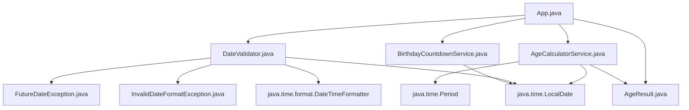

# Technical Specification

# 0. Agent Action Plan

## 0.1 Intent Clarification

### 0.1.1 Core Refactoring Objective

Based on the prompt, the Blitzy platform understands that the refactoring objective is to **create a standalone Java application from a greenfield (empty) repository** that calculates a user's exact age based on their Date of Birth (DOB). The repository currently contains only a placeholder `README.md` file with the heading `# 16_5` and no existing Java source code, configuration, or build files.

- **Refactoring type:** New project creation (greenfield build) — the repository has no pre-existing application code to restructure; the transformation is from an empty repository to a fully functional Maven-based Java project
- **Target repository:** Same repository — all new files will be created within the current repository root
- **Primary goal:** Build a console-based Java application that accepts a Date of Birth in `DD/MM/YYYY` format, calculates the exact age in years, months, and days using the `java.time` API, and presents the result in a human-readable format
- **Input handling:** Accept DOB via standard input (`System.in`) using `java.util.Scanner`, parse with `java.time.format.DateTimeFormatter` using the `DD/MM/YYYY` pattern
- **Core calculation:** Use `java.time.LocalDate` to represent dates and `java.time.Period` to compute the elapsed time between DOB and the current system date
- **Output format:** Display the age as `Your age is X years, Y months, and Z days.`
- **Validation requirements:** Reject future dates, reject invalid calendar dates (e.g., 31/02/2020), reject malformed input strings, and provide meaningful error messages for each failure case
- **Implicit requirements surfaced by Blitzy:**
  - The project must use a standard Maven build structure with `pom.xml`
  - Object-Oriented Programming principles must be followed — the application must not be a single monolithic class
  - Proper exception handling with `try-catch` blocks is mandatory
  - Leap year handling must be correct (the `java.time` API handles this natively)
  - The application must work for users born in any valid year representable by `LocalDate`

### 0.1.2 Technical Interpretation

This refactoring translates to the following technical transformation strategy:

- **From:** An empty repository containing only `README.md`
- **To:** A fully structured Maven project with OOP-compliant Java source code, unit tests, and build configuration

The transformation requires creating:
- A Maven `pom.xml` with Java 21 compiler settings and JUnit 5 test dependencies
- A package hierarchy under `src/main/java/com/agecalculator/` with clearly separated concerns (model, service, utility, exception, and entry point layers)
- A mirrored test package hierarchy under `src/test/java/com/agecalculator/` with comprehensive test coverage for all validation and calculation scenarios
- A `.gitignore` configured for Java/Maven artifacts
- An updated `README.md` with project documentation, build instructions, and usage examples

The architectural approach maps each functional requirement to a discrete class:

| Functional Requirement | Target Class | Responsibility |
|----------------------|-------------|---------------|
| Accept DOB input in DD/MM/YYYY | `App.java` | Entry point, user interaction via Scanner |
| Fetch current system date | `AgeCalculatorService.java` | Calls `LocalDate.now()` internally |
| Calculate exact age (years, months, days) | `AgeCalculatorService.java` | Uses `Period.between()` on two `LocalDate` instances |
| Display formatted result | `App.java` | Prints formatted output string |
| Validate DOB is not future date | `DateValidator.java` | Compares parsed date against `LocalDate.now()` |
| Handle invalid dates (e.g., 31/02/2020) | `DateValidator.java` | Catches `DateTimeParseException` with `ResolverStyle.STRICT` |
| Meaningful error messages | `FutureDateException.java`, `InvalidDateFormatException.java` | Custom exceptions with descriptive messages |
| Leap year correctness | `java.time.LocalDate` (built-in) | Native handling by the `java.time` API |
| OOP principles | Package structure | Model, Service, Util, Exception separation |
| Reusable utility method | `AgeCalculatorService.java` | Stateless service class with public calculation method |


## 0.2 Source Analysis

### 0.2.1 Comprehensive Source File Discovery

The repository was inspected using `get_source_folder_contents` on the root path and `bash` to read existing files. The repository is a greenfield project with no pre-existing application code, build configuration, or dependency manifests.

**Files discovered in the repository root:**

| File Path | Size | Status | Content Summary |
|-----------|------|--------|----------------|
| `README.md` | Minimal | UNCHANGED | Contains only the heading `# 16_5` — a placeholder with no project documentation |

**Search patterns executed with zero results:**

- `src/**/*.java` — No Java source files exist
- `pom.xml` — No Maven build file exists
- `build.gradle` — No Gradle build file exists
- `*.properties` — No configuration property files exist
- `*.xml` — No XML configuration files exist
- `.gitignore` — No Git ignore rules exist
- `test/**/*` — No test files exist
- `lib/**/*` — No library files exist
- `.blitzyignore` — No Blitzy ignore files exist (confirmed via `find / -name ".blitzyignore"`)

**Conclusion:** There are no legacy code patterns, no monolithic files to split, no tightly coupled modules, and no duplicate code to consolidate. The entire project must be created from scratch.

### 0.2.2 Current Structure Mapping

```
Current Repository State:
/
└── README.md          (placeholder — "# 16_5")
```

- **Total source files:** 0
- **Total test files:** 0
- **Total configuration files:** 0
- **Total dependency manifests:** 0
- **Lines of application code:** 0

Since the repository is empty, there are no files requiring refactoring in the traditional sense. The transformation is a full project scaffold creation. Every file in the target design will use the `CREATE` transformation mode, with the sole exception of `README.md` which will use `UPDATE` mode.


## 0.3 Scope Boundaries

### 0.3.1 Exhaustively In Scope

**Source transformations (all new file creation):**
- `pom.xml` — Maven build configuration with Java 21, JUnit 5, and plugin declarations
- `src/main/java/com/agecalculator/**/*.java` — All application source files
  - `App.java` — Main entry point with `Scanner`-based user interaction
  - `model/AgeResult.java` — POJO encapsulating the age calculation result (years, months, days)
  - `service/AgeCalculatorService.java` — Core business logic using `Period.between()`
  - `service/BirthdayCountdownService.java` — Optional enhancement calculating days until next birthday
  - `util/DateValidator.java` — Input validation for DOB format, future dates, and invalid calendar dates
  - `exception/FutureDateException.java` — Custom unchecked exception for future date input
  - `exception/InvalidDateFormatException.java` — Custom unchecked exception for malformed date input

**Test file creation:**
- `src/test/java/com/agecalculator/**/*Test.java` — All unit test files
  - `service/AgeCalculatorServiceTest.java` — Tests for age calculation with normal dates, leap year dates, edge cases
  - `service/BirthdayCountdownServiceTest.java` — Tests for countdown calculation
  - `util/DateValidatorTest.java` — Tests for validation of invalid dates, future dates, malformed input
  - `AppTest.java` — Smoke test for the main application class

**Configuration creation:**
- `pom.xml` — Maven project object model
- `.gitignore` — Java/Maven-specific ignore rules for `target/`, `*.class`, IDE files

**Documentation updates:**
- `README.md` — Complete rewrite with project description, build/run instructions, usage examples, and test case documentation

### 0.3.2 Explicitly Out of Scope

The following items are explicitly out of scope for this implementation, based on the user's requirements defining them as optional enhancements:

- **GUI implementation** — Java Swing or JavaFX graphical user interface is listed as an optional enhancement and is not part of the core deliverable
- **Web interface** — No web-based front end, REST API, or HTTP server
- **Database integration** — No persistence layer, database connections, or data storage
- **Internationalization (i18n)** — Date format is fixed to `DD/MM/YYYY`; no locale-specific formatting
- **Deployment configuration** — No Docker, CI/CD pipelines, or cloud deployment manifests
- **External library dependencies beyond JUnit** — No third-party date libraries (e.g., Joda-Time); the application uses only the JDK standard library `java.time` package
- **Interview-ready version or mini project documentation** — The user mentioned these as separate deliverables they could provide, not as requirements for the application itself
- **Total age in months and days display** — Listed as optional; may be included as an enhancement within `AgeResult` if trivially achievable alongside core logic, but is not a mandatory requirement
- **Time zone handling** — The application uses `LocalDate.now()` with the system default time zone; explicit time zone selection is not required


## 0.4 Target Design

### 0.4.1 Refactored Structure Planning

The target architecture follows the standard Maven directory layout with a clean Object-Oriented package hierarchy separating concerns into model, service, utility, and exception layers.

```
Target:
/
├── pom.xml                                                    (Maven build configuration — Java 21, JUnit 5.14.3)
├── .gitignore                                                 (Java/Maven ignore rules)
├── README.md                                                  (Updated project documentation)
└── src/
    ├── main/
    │   └── java/
    │       └── com/
    │           └── agecalculator/
    │               ├── App.java                               (Main entry point — Scanner input, output formatting)
    │               ├── model/
    │               │   └── AgeResult.java                     (Immutable POJO — years, months, days, formatted output)
    │               ├── service/
    │               │   ├── AgeCalculatorService.java          (Core calculation — Period.between logic)
    │               │   └── BirthdayCountdownService.java      (Enhancement — days until next birthday)
    │               ├── util/
    │               │   └── DateValidator.java                 (Input validation — format, future date, invalid date checks)
    │               └── exception/
    │                   ├── FutureDateException.java           (Custom exception — DOB is in the future)
    │                   └── InvalidDateFormatException.java    (Custom exception — malformed or impossible date)
    └── test/
        └── java/
            └── com/
                └── agecalculator/
                    ├── AppTest.java                           (Smoke test for main class)
                    ├── service/
                    │   ├── AgeCalculatorServiceTest.java      (Normal DOB, leap year, boundary tests)
                    │   └── BirthdayCountdownServiceTest.java  (Countdown calculation tests)
                    └── util/
                        └── DateValidatorTest.java             (Invalid date, future date, format tests)
```

**Total files to create:** 12 new files
**Total files to update:** 1 existing file (`README.md`)
**Total directories to create:** 14 new directories

### 0.4.2 Web Search Research Conducted

The following research was conducted to inform the target design:

- **Maven project structure best practices (2025):** Confirmed the standard `src/main/java` and `src/test/java` layout. Maven enforces convention-over-configuration, automatically compiling `src/main/java` to `target/classes` and running tests from `src/test/java`. The `<maven.compiler.release>` property is the recommended way to set Java version for JDK 9+.
- **JUnit 5 Maven dependency configuration:** Verified that `junit-jupiter-api` version 5.14.3 is the latest stable release in the 5.x series. The `maven-surefire-plugin` version 3.5.5 is required for JUnit 5 test execution.
- **Java `Period.between()` age calculation patterns:** Confirmed that `Period.between(birthDate, currentDate)` returns a `Period` object from which `.getYears()`, `.getMonths()`, and `.getDays()` extract the age components. The `java.time` API natively handles leap years and variable month lengths.
- **Date validation with `ResolverStyle.STRICT`:** The `DateTimeFormatter` with `ResolverStyle.STRICT` rejects impossible dates like `31/02/2020` by requiring `uuuu` (proleptic year) instead of `yyyy` and validating all date components against calendar rules.

### 0.4.3 Design Pattern Applications

The following OOP design patterns and principles are applied in the target architecture:

- **Single Responsibility Principle (SRP):** Each class has one clearly defined responsibility — `App` handles I/O, `AgeCalculatorService` handles calculation, `DateValidator` handles validation, and custom exceptions handle error representation
- **Separation of Concerns:** The package structure isolates model, service, utility, and exception layers so each can evolve independently
- **Immutable Value Object pattern:** `AgeResult` is designed as an immutable class with `final` fields and getter methods, encapsulating the computed age (years, months, days) as a single coherent result
- **Service pattern:** `AgeCalculatorService` and `BirthdayCountdownService` are stateless service classes with pure functions that take input parameters and return results, making them trivially testable
- **Custom Exception hierarchy:** `FutureDateException` and `InvalidDateFormatException` extend `RuntimeException` (unchecked), providing specific error types that callers can catch and handle distinctly from generic exceptions
- **Utility class pattern:** `DateValidator` contains static methods for input validation, consolidating all validation logic in one place
- **Dependency injection readiness:** The service classes accept `LocalDate` parameters rather than calling `LocalDate.now()` internally (except in the main entry point), enabling unit tests to inject specific dates without mocking static methods


## 0.5 Transformation Mapping

### 0.5.1 File-by-File Transformation Plan

The entire project is created in **one phase**. Every target file is listed below with its transformation mode, source reference (if applicable), and key changes.

| Target File | Transformation | Source File | Key Changes |
|------------|---------------|-------------|-------------|
| `pom.xml` | CREATE | — | New Maven POM with groupId `com.agecalculator`, artifactId `age-calculator`, Java 21 compiler target, JUnit Jupiter 5.14.3 test dependency, maven-compiler-plugin 3.15.0, maven-surefire-plugin 3.5.5 |
| `.gitignore` | CREATE | — | Standard Java/Maven ignore rules: `target/`, `*.class`, `*.jar`, `.idea/`, `*.iml`, `.settings/`, `.classpath`, `.project`, `*.log` |
| `README.md` | UPDATE | `README.md` | Replace placeholder `# 16_5` with full project documentation: description, prerequisites (Java 21, Maven 3.8+), build commands (`mvn clean package`), run instructions (`java -jar`), input/output examples, test execution, and test case descriptions |
| `src/main/java/com/agecalculator/App.java` | CREATE | — | Main class with `public static void main(String[])` entry point; reads DOB via `Scanner` from `System.in`; parses input using `DateValidator`; calculates age via `AgeCalculatorService`; prints formatted result; wraps logic in `try-catch` for graceful error handling |
| `src/main/java/com/agecalculator/model/AgeResult.java` | CREATE | — | Immutable POJO with `private final int years`, `private final int months`, `private final int days`; constructor accepting all three fields; getter methods; `toString()` returning `"Your age is X years, Y months, and Z days."` format |
| `src/main/java/com/agecalculator/service/AgeCalculatorService.java` | CREATE | — | Stateless service class with method `AgeResult calculateAge(LocalDate dob, LocalDate currentDate)` that uses `Period.between(dob, currentDate)` to compute the age and returns an `AgeResult` instance |
| `src/main/java/com/agecalculator/service/BirthdayCountdownService.java` | CREATE | — | Enhancement service with method `long daysUntilNextBirthday(LocalDate dob, LocalDate currentDate)` that calculates the number of days remaining until the user's next birthday using `LocalDate` arithmetic |
| `src/main/java/com/agecalculator/util/DateValidator.java` | CREATE | — | Utility class with static methods: `LocalDate parseAndValidate(String input)` — parses `DD/MM/YYYY` string using `DateTimeFormatter` with `ResolverStyle.STRICT`, throws `InvalidDateFormatException` for malformed/impossible dates, throws `FutureDateException` if parsed date is after `LocalDate.now()` |
| `src/main/java/com/agecalculator/exception/FutureDateException.java` | CREATE | — | Custom unchecked exception extending `RuntimeException`; constructor accepts a `String` message; used when the user enters a DOB that is in the future |
| `src/main/java/com/agecalculator/exception/InvalidDateFormatException.java` | CREATE | — | Custom unchecked exception extending `RuntimeException`; constructor accepts a `String` message and optional `Throwable` cause; used when input cannot be parsed as a valid date |
| `src/test/java/com/agecalculator/AppTest.java` | CREATE | — | Smoke test verifying the `App` class can be instantiated and its main method exists; basic integration test |
| `src/test/java/com/agecalculator/service/AgeCalculatorServiceTest.java` | CREATE | — | Comprehensive tests: normal DOB (e.g., 15/08/1998), leap year DOB (29/02/2000), same-day birth, newborn (born today), age exactly on birthday boundary, multi-decade age calculation |
| `src/test/java/com/agecalculator/service/BirthdayCountdownServiceTest.java` | CREATE | — | Tests: birthday tomorrow (1 day), birthday today (0 or 365/366 days), birthday in 6 months, leap year birthday countdown |
| `src/test/java/com/agecalculator/util/DateValidatorTest.java` | CREATE | — | Tests: valid date parsing, invalid date rejection (31/02/2020), future date rejection, wrong format input (YYYY-MM-DD instead of DD/MM/YYYY), empty string, null input, non-date strings |

**Summary:** 1 file updated (`README.md`), 13 files created, 0 files deleted.

### 0.5.2 Cross-File Dependencies

The dependency graph between application classes is as follows:



**Import relationships between project classes:**

| Source File | Imports From Project |
|------------|---------------------|
| `App.java` | `com.agecalculator.model.AgeResult`, `com.agecalculator.service.AgeCalculatorService`, `com.agecalculator.service.BirthdayCountdownService`, `com.agecalculator.util.DateValidator`, `com.agecalculator.exception.FutureDateException`, `com.agecalculator.exception.InvalidDateFormatException` |
| `AgeCalculatorService.java` | `com.agecalculator.model.AgeResult` |
| `DateValidator.java` | `com.agecalculator.exception.FutureDateException`, `com.agecalculator.exception.InvalidDateFormatException` |
| `BirthdayCountdownService.java` | (no project imports — uses only `java.time` classes) |
| `AgeResult.java` | (no project imports — standalone POJO) |
| `FutureDateException.java` | (no project imports — extends `RuntimeException`) |
| `InvalidDateFormatException.java` | (no project imports — extends `RuntimeException`) |

**JDK import requirements across source files:**

| JDK Package | Used By |
|------------|---------|
| `java.time.LocalDate` | `App.java`, `AgeCalculatorService.java`, `DateValidator.java`, `BirthdayCountdownService.java` |
| `java.time.Period` | `AgeCalculatorService.java` |
| `java.time.format.DateTimeFormatter` | `DateValidator.java` |
| `java.time.format.ResolverStyle` | `DateValidator.java` |
| `java.time.temporal.ChronoUnit` | `BirthdayCountdownService.java` |
| `java.util.Scanner` | `App.java` |

**Configuration references:**

- `pom.xml` references `com.agecalculator.App` as the main class (for `maven-jar-plugin` manifest configuration)
- All test files mirror the package structure of the main source files they test
- No external configuration files, property files, or resource files are required — all configuration is in `pom.xml`


## 0.6 Dependency Inventory

### 0.6.1 Key Packages

All dependency versions have been verified against Maven Central repository metadata as of this analysis.

**Runtime Dependencies:**

| Registry | Package Name | Version | Scope | Purpose |
|----------|-------------|---------|-------|---------|
| JDK | `java.time` (LocalDate, Period, DateTimeFormatter) | 21.0.10 (bundled with JDK 21) | Runtime | Core date/time API for age calculation, date parsing, and formatting |
| JDK | `java.util.Scanner` | 21.0.10 (bundled with JDK 21) | Runtime | Console input reading for DOB entry |

**Test Dependencies:**

| Registry | Package Name | Version | Scope | Purpose |
|----------|-------------|---------|-------|---------|
| Maven Central | `org.junit.jupiter:junit-jupiter-api` | 5.14.3 | test | JUnit 5 test annotations (`@Test`, `@DisplayName`), assertions (`assertEquals`, `assertThrows`) |
| Maven Central | `org.junit.jupiter:junit-jupiter-engine` | 5.14.3 | test | JUnit 5 test execution engine for Maven Surefire integration |

**Build Plugins:**

| Registry | Plugin Name | Version | Purpose |
|----------|------------|---------|---------|
| Maven Central | `org.apache.maven.plugins:maven-compiler-plugin` | 3.15.0 | Compiles Java 21 source code with `<release>21</release>` configuration |
| Maven Central | `org.apache.maven.plugins:maven-surefire-plugin` | 3.5.5 | Executes JUnit 5 tests during `mvn test` phase |
| Maven Central | `org.apache.maven.plugins:maven-jar-plugin` | 3.4.2 | Configures JAR manifest with `Main-Class: com.agecalculator.App` for executable JAR |

**Notes:**
- The application has **zero external runtime dependencies** — it uses only the JDK standard library (`java.time` and `java.util` packages)
- All test dependencies use `<scope>test</scope>` and are not included in the final packaged artifact
- No third-party date libraries (e.g., Joda-Time, Apache Commons Lang) are required

### 0.6.2 Dependency Updates

Since this is a greenfield project with no existing dependency manifests, there are no legacy imports to refactor. However, the following dependency configuration must be established in the new `pom.xml`:

**Maven POM configuration structure:**

```xml
<properties>
  <maven.compiler.release>21</maven.compiler.release>
  <junit.jupiter.version>5.14.3</junit.jupiter.version>
</properties>
```

**Import patterns to be established across source files:**

- All `src/main/java/com/agecalculator/**/*.java` files — Standard `java.time.*` imports as documented in the Cross-File Dependencies table (Section 0.5.2)
- All `src/test/java/com/agecalculator/**/*Test.java` files — `org.junit.jupiter.api.Test`, `org.junit.jupiter.api.DisplayName`, `org.junit.jupiter.api.Assertions.*` (static import)

**External Reference Configuration:**

| File | Configuration Element | Value |
|------|--------------------|-------|
| `pom.xml` | `<groupId>` | `com.agecalculator` |
| `pom.xml` | `<artifactId>` | `age-calculator` |
| `pom.xml` | `<version>` | `1.0-SNAPSHOT` |
| `pom.xml` | `<maven.compiler.release>` | `21` |
| `pom.xml` | `<project.build.sourceEncoding>` | `UTF-8` |
| `pom.xml` | JUnit Jupiter dependency version | `5.14.3` |
| `pom.xml` | Surefire plugin version | `3.5.5` |
| `pom.xml` | Compiler plugin version | `3.15.0` |
| `pom.xml` | JAR plugin version | `3.4.2` |
| `pom.xml` | Main-Class manifest entry | `com.agecalculator.App` |


## 0.7 Refactoring Rules

### 0.7.1 Refactoring-Specific Rules

The following rules are derived directly from the user's requirements and must be strictly adhered to during implementation:

- **Use `java.time.LocalDate`, `java.time.Period`, and `java.time.format.DateTimeFormatter`** — These three classes are explicitly mandated by the user. No alternative date/time libraries or legacy `java.util.Date` / `java.util.Calendar` classes may be used for date operations.
- **Follow Object-Oriented Programming principles** — The application must not be implemented as a single class with all logic in `main()`. Responsibilities must be separated into model, service, utility, and exception classes as defined in the target design.
- **Proper exception handling using `try-catch`** — All user-facing error scenarios must be wrapped in `try-catch` blocks in the main entry point. Custom exceptions must provide meaningful error messages. The application must never crash with an unhandled stack trace visible to the user.
- **Handle leap years correctly** — The `java.time` API handles leap years natively, but test cases must explicitly verify correct behavior for leap year dates (e.g., 29/02/2000 as a valid DOB).
- **Work for users born in any valid year** — The application must not impose arbitrary year range limits beyond what `LocalDate` supports.
- **Clean and readable coding standards** — Code must follow standard Java naming conventions (camelCase for methods/variables, PascalCase for classes), include Javadoc comments on public methods, and use meaningful variable names.
- **Accept input in DD/MM/YYYY format only** — The date parser must use this exact pattern. The user explicitly specified this format.
- **Display result in the exact format:** `Your age is X years, Y months, and Z days.` — This output string format is a mandatory requirement.

### 0.7.2 Special Instructions and Constraints

- **Test case coverage requirements** — The user specified five specific test scenarios that must be covered:
  - User Example: Normal DOB → `15/08/1998` — Must calculate and display correct age
  - User Example: Leap year DOB → `29/02/2000` — Must be accepted as valid and calculate correctly
  - User Example: Invalid date → `31/02/2020` — Must be rejected with a meaningful error message
  - User Example: Future date → Any date after today — Must be rejected with a meaningful error message
  - User Example: Wrong format input → Non-DD/MM/YYYY strings — Must be rejected with a meaningful error message

- **Sample I/O contract** — The user provided an explicit input/output example:
  - User Example Input: `Enter your Date of Birth (DD/MM/YYYY): 15/08/1998`
  - User Example Output: `Your age is 27 years, 6 months, and 15 days.`
  - Note: The actual output values will vary based on the current system date at runtime

- **Optional enhancements acknowledged** — The user listed four optional enhancements. The following are incorporated into the target design where trivially achievable alongside core logic:
  - Total age in months and days — Achievable via additional methods on `AgeResult`
  - Countdown to next birthday — Implemented as `BirthdayCountdownService`
  - The following remain explicitly out of scope: GUI (Swing/JavaFX), interview-ready version, mini project documentation as separate deliverables

- **Single-phase execution** — The entire project is built in one phase. There is no phased rollout, no incremental delivery, and no feature flags. All 14 files (13 new + 1 updated) are delivered together as a complete, compilable, testable project.

- **No backward compatibility concerns** — Since the repository is empty, there are no existing consumers, APIs, or integrations that could break. The project is created as a standalone self-contained application.


## 0.8 References

### 0.8.1 Repository Files and Folders Searched

The following files and folders were searched across the codebase to derive the conclusions in this Agent Action Plan:

| Path | Tool Used | Finding |
|------|-----------|---------|
| `/` (repository root) | `get_source_folder_contents` | Repository contains only `README.md`; no source code, build files, or configuration |
| `README.md` | `bash` (cat) | Contains only the placeholder heading `# 16_5` — no project documentation |
| `*.blitzyignore` (global search) | `bash` (find) | No `.blitzyignore` files found anywhere in the filesystem |
| `/tmp/environments_files/` | `bash` (ls) | Directory does not exist; no user-provided environment files |

### 0.8.2 Technical Specification Sections Reviewed

The following tech spec sections were retrieved and reviewed for context:

| Section | Key Finding |
|---------|------------|
| 1.2 Executive Summary | Placeholder stubs — no project-specific information defined |
| 1.4 Scope | Placeholder stubs with TBD entries — no scope boundaries defined |
| 2.3 Functional Requirements Framework | Template structures only — no actual functional requirements |
| 3.2 Programming Languages | Describes Python 3.11+, TypeScript 5.x, Swift, Kotlin, Objective-C — not applicable to this Java project |
| 3.3 Frameworks & Libraries | Describes Flask 3.x, React 18.x, React-Native, TailwindCSS — not applicable to this Java project |
| 5.1 High-Level Architecture | Describes multi-platform cloud-native system with AWS services — not applicable to this standalone console application |
| 6.6 Testing Strategy | Describes pytest/Jest/Playwright stack — methodology reference for test pyramid (70% unit, 20% integration, 10% E2E) |

**Note:** The existing tech spec describes an entirely different technology stack and system architecture (Python/Flask/React multi-platform cloud application). None of the existing spec content is directly applicable to this Java Age Calculator project. The Agent Action Plan was derived entirely from the user's prompt requirements and web research.

### 0.8.3 Web Research Conducted

| Research Topic | Key Sources Consulted | Key Findings Applied |
|---------------|----------------------|---------------------|
| Maven project structure best practices | Maven official documentation (maven.apache.org), Baeldung, GeeksforGeeks | Standard `src/main/java` and `src/test/java` layout; `<maven.compiler.release>` property for JDK 9+ |
| JUnit 5 Maven dependency versions | Maven Central repository metadata (repo1.maven.org), Maven Surefire Plugin docs | JUnit Jupiter 5.14.3 (latest stable), Surefire 3.5.5, Compiler Plugin 3.15.0 |
| Java `Period.between()` age calculation | Baeldung, HowToDoInJava, GeeksforGeeks, W3Resource | `Period.between(birthDate, currentDate)` with `.getYears()`, `.getMonths()`, `.getDays()` is the standard pattern; `DateTimeFormatter` with `ResolverStyle.STRICT` for validation |

### 0.8.4 Attachments and External Resources

- **User attachments:** None provided (0 attachments)
- **Figma URLs:** None provided
- **Environment files:** None provided
- **Setup instructions:** None provided
- **Implementation rules:** None specified


