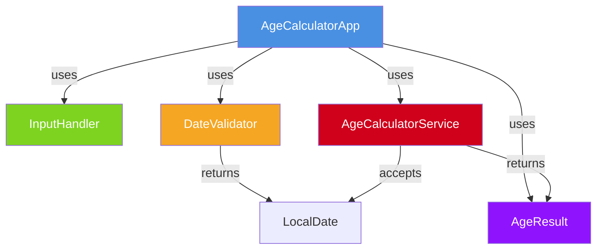
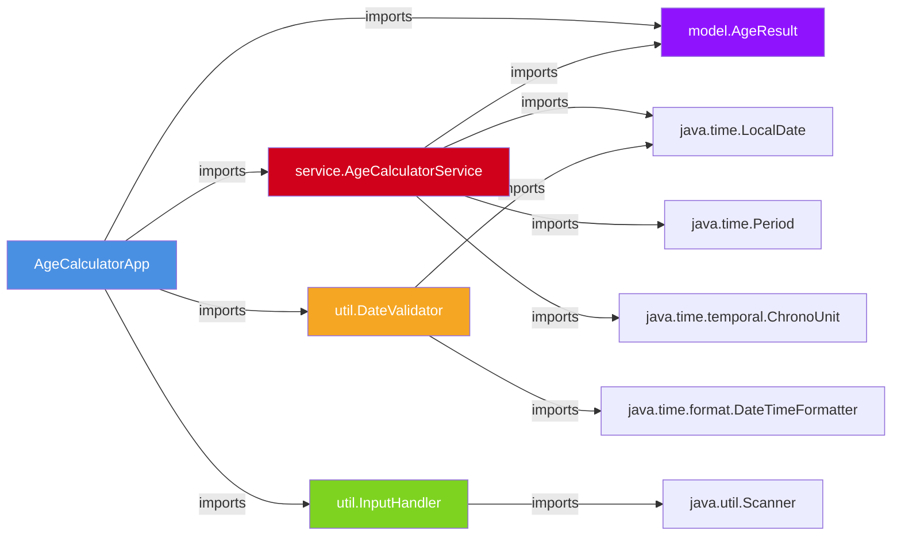

# Technical Specification

# 0. Agent Action Plan

## 0.1 Intent Clarification

### 0.1.1 Core Objective

Based on the provided requirements, the Blitzy platform understands that the objective is to develop a **Java console application** that calculates a user's exact age based on their Date of Birth (DOB). Specifically, the platform interprets the following requirements:

- **DOB Input Acceptance**: The application must accept a Date of Birth from the user via console input in the **DD/MM/YYYY** format, utilizing `java.time.format.DateTimeFormatter` for precise date parsing
- **System Date Retrieval**: The application must automatically fetch the current system date using `java.time.LocalDate.now()` to serve as the reference point for age calculation
- **Exact Age Calculation**: The application must compute the exact age broken down into **Years**, **Months**, and **Days** using `java.time.Period.between()` to determine the elapsed period between the DOB and the current date
- **Formatted Output**: The result must be displayed in the exact format: `Your age is X years, Y months, and Z days.`
- **Input Validation**: The application must validate that the DOB is not a future date, reject invalid calendar dates (e.g., 31/02/2020), and provide meaningful error messages for all incorrect input scenarios
- **OOP Compliance**: The application must follow Object-Oriented Programming principles with proper class decomposition, encapsulation, and separation of concerns
- **Exception Handling**: All error conditions must be handled gracefully using `try-catch` blocks with user-friendly error messages rather than raw stack traces
- **Leap Year Handling**: The date calculation logic must correctly account for leap years (e.g., February 29 in leap years)

The platform also identifies the following **implicit requirements**:
- The application must compile and run on **Java 8+** due to the dependency on `java.time` APIs, with Java 17 LTS being the target runtime
- A clean package structure following Java naming conventions is required to satisfy the OOP mandate
- The `Scanner` class will be needed for console input, which is an implicit standard library dependency
- Proper resource management (closing `Scanner`) is needed to prevent resource leaks

### 0.1.2 Task Categorization

- **Primary task type**: New Product — This is a greenfield Java application built from scratch in an empty repository
- **Secondary aspects**: Educational/Tutorial — The project serves as a learning exercise demonstrating OOP principles, the `java.time` API, and input validation patterns in Java
- **Scope classification**: Isolated change — The application is self-contained with no external dependencies, no database, and no integration points; it operates entirely within a single JVM process via console I/O

### 0.1.3 Special Instructions and Constraints

The user specifies the following directives that must be strictly observed:

- **Mandatory Java APIs**: Must use `java.time.LocalDate`, `java.time.Period`, and `java.time.format.DateTimeFormatter` — no legacy `java.util.Date` or `java.util.Calendar` usage permitted
- **OOP Principles**: The code must follow Object-Oriented Programming principles with proper class design, not a single monolithic main method
- **Exception Handling**: Must use `try-catch` for all error conditions with clean, user-friendly messaging
- **Date Format**: Input must be accepted strictly in **DD/MM/YYYY** format
- **Clean Code**: The application must follow clean and readable coding standards

**Optional Enhancements** documented by the user (to be included in scope for a complete implementation):
- Show total age in months and days
- Display countdown to next birthday
- Convert into a reusable method inside a utility class

**User Example (preserved verbatim)**:

Input:
```plaintext
Enter your Date of Birth (DD/MM/YYYY): 15/08/1998
```

Output:
```plaintext
Your age is 27 years, 6 months, and 15 days.
```

### 0.1.4 Technical Interpretation

These requirements translate to the following technical implementation strategy:

- To **accept and parse DOB input**, we will create an `InputHandler` utility that reads console input using `java.util.Scanner` and parses it into a `LocalDate` using a `DateTimeFormatter` configured with the pattern `dd/MM/yyyy` and `ResolverStyle.STRICT` to reject invalid calendar dates
- To **calculate the exact age**, we will create an `AgeCalculatorService` class that encapsulates the business logic using `Period.between(dobDate, LocalDate.now())` to obtain the years, months, and days components
- To **encapsulate the result**, we will create an `AgeResult` model class that holds the years, months, and days values with a properly formatted `toString()` method producing the required output format
- To **validate input**, we will create a `DateValidator` utility class that checks for future dates, invalid date formats, and null/empty input, throwing descriptive custom exceptions or returning meaningful error messages
- To **provide optional enhancements**, the `AgeCalculatorService` will include methods for computing total months, total days, and countdown to next birthday using `ChronoUnit` and `Period` utilities
- To **serve as the entry point**, we will create an `AgeCalculatorApp` main class that orchestrates the flow: prompt → read input → validate → calculate → display result, all within a clean `try-catch` structure

## 0.2 Repository Scope Discovery

### 0.2.1 Comprehensive File Analysis

The repository is a **greenfield project** containing only a single file at the root level. A thorough repository inspection reveals the following current state:

**Current Repository Contents:**

| Path | Type | Content | Relevance |
|------|------|---------|-----------|
| `README.md` | File | Contains a single line: `# 16_4` | Must be updated with project documentation, build instructions, and usage guide |

**Repository Characteristics:**
- No existing Java source files, packages, or compiled artifacts
- No build tool configuration (no `pom.xml`, `build.gradle`, or `Makefile`)
- No dependency manifests or lock files
- No `.gitignore` file for Java-specific patterns
- No test directories or test infrastructure
- No CI/CD configuration files
- No `.blitzyignore` files present in the repository

**Files and Directories to Be Created:**

Since this is a greenfield project, all Java source files, the package structure, and supporting configuration must be created from scratch. The following directory structure is required based on the user's OOP and Java best practices requirements:

```
project-root/
├── README.md                                          (UPDATE)
├── .gitignore                                         (CREATE)
├── src/
│   └── main/
│       └── java/
│           └── com/
│               └── agecalculator/
│                   ├── AgeCalculatorApp.java           (CREATE)
│                   ├── model/
│                   │   └── AgeResult.java              (CREATE)
│                   ├── service/
│                   │   └── AgeCalculatorService.java   (CREATE)
│                   └── util/
│                       ├── DateValidator.java          (CREATE)
│                       └── InputHandler.java           (CREATE)
└── src/
    └── test/
        └── java/
            └── com/
                └── agecalculator/
                    ├── service/
                    │   └── AgeCalculatorServiceTest.java (CREATE)
                    └── util/
                        └── DateValidatorTest.java       (CREATE)
```

### 0.2.2 Web Search Research Conducted

The following research was conducted to validate the implementation approach and ensure alignment with Java best practices:

- **Java age calculation using `Period.between()`**: Confirmed that `Period.between(startDate, endDate)` is the idiomatic Java 8+ approach for calculating elapsed years, months, and days between two `LocalDate` instances. The method correctly handles leap years and month-boundary edge cases.
- **Java `DateTimeFormatter` with strict resolution**: Validated that using `DateTimeFormatter.ofPattern("dd/MM/yyyy").withResolverStyle(ResolverStyle.STRICT)` combined with `LocalDate.parse()` will reject invalid calendar dates like `31/02/2020` by throwing a `DateTimeParseException`.
- **Java OOP project structure best practices**: The Maven standard directory layout (`src/main/java` and `src/test/java`) is the widely accepted convention for organizing Java projects, even for projects that do not use Maven as a build tool.
- **Java `ChronoUnit` for single-unit calculations**: `ChronoUnit.DAYS.between()` and `ChronoUnit.MONTHS.between()` provide total age in a single unit, supporting the optional enhancement for total months and total days display.
- **Next birthday countdown pattern**: The Oracle official tutorial demonstrates using `LocalDate.withYear()` combined with `Period.between()` for calculating days until the next birthday, including proper handling when the birthday has already occurred in the current year.

### 0.2.3 Existing Infrastructure Assessment

- **Current project structure**: Empty repository with only a `README.md` placeholder — no existing patterns, conventions, or infrastructure to follow
- **Build and deployment configurations**: None present — the project will be compiled and run directly using `javac` and `java` commands without a build tool, keeping the educational focus on Java fundamentals
- **Testing infrastructure**: None present — test classes will be created following the standard `src/test/java` convention for manual execution using `javac` and `java`, maintaining simplicity without introducing JUnit or other test frameworks unless strictly needed
- **Documentation system**: Only a minimal `README.md` exists — it must be expanded to serve as the project's primary documentation with setup instructions, usage guide, and test case descriptions
- **Runtime environment**: Java 17.0.18 (OpenJDK) confirmed installed and operational at `/usr/lib/jvm/java-17-openjdk-amd64`

## 0.3 Scope Boundaries

### 0.3.1 Exhaustively In Scope

**Source Code (all files to be created):**
- `src/main/java/com/agecalculator/AgeCalculatorApp.java` — Main entry point class with console I/O orchestration
- `src/main/java/com/agecalculator/model/AgeResult.java` — Data model encapsulating age calculation results (years, months, days)
- `src/main/java/com/agecalculator/service/AgeCalculatorService.java` — Core business logic for age calculation, total age metrics, and next birthday countdown
- `src/main/java/com/agecalculator/util/DateValidator.java` — Input validation utility for date format, future date, and invalid calendar date checks
- `src/main/java/com/agecalculator/util/InputHandler.java` — Console input handler wrapping `Scanner` with resource management
- `src/test/java/com/agecalculator/service/AgeCalculatorServiceTest.java` — Test class validating age calculation logic across normal, edge, and error scenarios
- `src/test/java/com/agecalculator/util/DateValidatorTest.java` — Test class validating date validation logic including invalid dates, future dates, and format errors

**Documentation:**
- `README.md` — Updated with project description, prerequisites, build/run instructions, usage examples, test case documentation, and project structure overview

**Configuration:**
- `.gitignore` — Java-specific ignore rules for compiled `.class` files, IDE metadata, and OS artifacts

**Functional Scope:**
- Accept DOB input in DD/MM/YYYY format from console
- Parse input using strict `DateTimeFormatter` to reject invalid calendar dates
- Calculate exact age in years, months, and days using `Period.between()`
- Display age in the format: `Your age is X years, Y months, and Z days.`
- Validate against future dates with a meaningful error message
- Handle invalid date format input with a descriptive error message
- Handle leap year dates correctly (e.g., 29/02/2000)
- Provide optional enhancements: total age in months/days, countdown to next birthday
- Encapsulate logic in a reusable utility/service class per OOP principles

### 0.3.2 Explicitly Out of Scope

- **GUI Implementation**: Java Swing or JavaFX graphical interface (mentioned as optional by user, deferred as a future enhancement beyond the current core console application)
- **Build Tool Integration**: Maven `pom.xml` or Gradle `build.gradle` — the project compiles with `javac` directly, keeping focus on Java fundamentals
- **External Dependencies**: No third-party libraries (Joda-Time, Apache Commons, etc.) — all functionality uses Java standard library classes only
- **Database or Persistence**: No file storage, database, or data persistence of any kind
- **Web Interface or API**: No HTTP endpoints, REST APIs, or web-based access
- **Internationalization**: No localization of date formats, error messages, or locale-aware formatting beyond the specified DD/MM/YYYY format
- **Logging Framework**: No SLF4J, Log4j, or other logging library — console output via `System.out` and `System.err` only
- **CI/CD Pipeline**: No GitHub Actions, Jenkins, or other CI/CD configuration
- **Advanced Testing Frameworks**: No JUnit 5, TestNG, or Mockito dependencies — test validation will be conducted through simple Java main-method-based test classes that print pass/fail results
- **Performance Optimization**: No benchmarking, profiling, or performance tuning beyond correct functional behavior
- **Multi-user or Concurrent Access**: The application is a single-threaded console program — no concurrency considerations

## 0.4 Dependency Inventory

### 0.4.1 Key Private and Public Packages

This project has **zero external dependencies**. All functionality is implemented exclusively using Java Standard Library (JDK) classes. The following table catalogs the standard library packages required:

| Registry | Package / Class | Version | Purpose |
|----------|----------------|---------|---------|
| JDK (built-in) | `java.time.LocalDate` | Bundled with JDK 8+ | Represents a date without time-zone; stores the DOB and current date |
| JDK (built-in) | `java.time.Period` | Bundled with JDK 8+ | Calculates the elapsed time between two dates in years, months, and days |
| JDK (built-in) | `java.time.format.DateTimeFormatter` | Bundled with JDK 8+ | Parses user input string into `LocalDate` using the `dd/MM/yyyy` pattern |
| JDK (built-in) | `java.time.format.ResolverStyle` | Bundled with JDK 8+ | Enables strict date resolution to reject invalid calendar dates (e.g., Feb 31) |
| JDK (built-in) | `java.time.temporal.ChronoUnit` | Bundled with JDK 8+ | Computes total age in a single unit (total months, total days) for optional enhancements |
| JDK (built-in) | `java.util.Scanner` | Bundled with JDK 1.5+ | Reads user input from the console (System.in) |
| JDK (built-in) | `java.time.format.DateTimeParseException` | Bundled with JDK 8+ | Exception thrown on invalid date format or value during parsing |

### 0.4.2 Runtime Environment

| Component | Version | Installation Path | Notes |
|-----------|---------|------------------|-------|
| OpenJDK | 17.0.18 | `/usr/lib/jvm/java-17-openjdk-amd64` | LTS release; provides all `java.time` APIs required by the project |
| `javac` | 17.0.18 | System PATH | Java compiler for source-to-bytecode compilation |
| `java` | 17.0.18 | System PATH | Java runtime for executing compiled bytecode |

### 0.4.3 Dependency Updates

- **New dependencies to add**: None — the project uses only Java standard library classes
- **Dependencies to update**: Not applicable — no existing dependencies in this greenfield project
- **Dependencies to remove**: Not applicable

### 0.4.4 Import/Reference Updates

Since all files are new, no import migration is required. The following import patterns will be established in the new source files:

- `src/main/java/com/agecalculator/service/AgeCalculatorService.java`:
  - `import java.time.LocalDate;`
  - `import java.time.Period;`
  - `import java.time.temporal.ChronoUnit;`

- `src/main/java/com/agecalculator/util/DateValidator.java`:
  - `import java.time.LocalDate;`
  - `import java.time.format.DateTimeFormatter;`
  - `import java.time.format.DateTimeParseException;`
  - `import java.time.format.ResolverStyle;`

- `src/main/java/com/agecalculator/util/InputHandler.java`:
  - `import java.util.Scanner;`

- `src/main/java/com/agecalculator/AgeCalculatorApp.java`:
  - `import com.agecalculator.model.AgeResult;`
  - `import com.agecalculator.service.AgeCalculatorService;`
  - `import com.agecalculator.util.DateValidator;`
  - `import com.agecalculator.util.InputHandler;`

## 0.5 Implementation Design

### 0.5.1 Technical Approach

**Primary objectives with implementation approach:**

- Achieve **exact age calculation from DOB** by creating an `AgeCalculatorService` class that uses `Period.between(dob, LocalDate.now())` to compute years, months, and days, encapsulating the result in an `AgeResult` model object
- Achieve **robust input validation** by creating a `DateValidator` utility that configures `DateTimeFormatter` with `ResolverStyle.STRICT` to reject non-existent calendar dates, and performs explicit future-date checks against the current system date
- Achieve **clean console interaction** by creating an `InputHandler` wrapper around `java.util.Scanner` that manages resource lifecycle and provides a reusable prompt-and-read interface
- Achieve **proper OOP structure** by decomposing the application into dedicated classes — model (`AgeResult`), service (`AgeCalculatorService`), utility (`DateValidator`, `InputHandler`), and application (`AgeCalculatorApp`) — following the Single Responsibility Principle

**Logical implementation flow:**

- First, establish the **data model foundation** by creating `AgeResult` to encapsulate years, months, and days as an immutable value object with a formatted `toString()` method
- Next, implement the **core business logic** by creating `AgeCalculatorService` with methods for exact age calculation, total months/days computation, and next birthday countdown using `Period` and `ChronoUnit`
- Then, build the **input validation layer** by creating `DateValidator` that parses DD/MM/YYYY strings with strict resolution and validates against future dates, returning parsed `LocalDate` instances or throwing descriptive exceptions
- Then, create the **input handling layer** by building `InputHandler` to manage `Scanner` lifecycle and provide clean console I/O
- Finally, wire everything together in `AgeCalculatorApp` as the **orchestration entry point** that coordinates the prompt → validate → calculate → display flow within a `try-catch` structure

### 0.5.2 Component Impact Analysis

**New components to create:**



- **AgeCalculatorApp**: Create as the main entry-point class to orchestrate the user interaction flow — prompt for DOB, validate, calculate, and display results. Contains the `main(String[] args)` method.
- **AgeResult** (model): Create as an immutable data class to hold the calculated age components (years, months, days) with getter methods and a `toString()` that produces the required output format `Your age is X years, Y months, and Z days.`
- **AgeCalculatorService** (service): Create as the core calculation engine with methods:
  - `calculateAge(LocalDate dob)` → returns `AgeResult`
  - `getTotalMonths(LocalDate dob)` → returns `long`
  - `getTotalDays(LocalDate dob)` → returns `long`
  - `getDaysUntilNextBirthday(LocalDate dob)` → returns `long`
- **DateValidator** (utility): Create to encapsulate all validation logic with a static method `parseAndValidate(String input)` that returns a validated `LocalDate` or throws an `IllegalArgumentException` with a user-friendly message
- **InputHandler** (utility): Create to wrap `Scanner` with a `readInput(String prompt)` method and a `close()` method for resource cleanup

**Indirect impacts and dependencies:**
- The `AgeCalculatorApp` depends on all four other classes, serving as the composition root
- `AgeCalculatorService` depends on `AgeResult` as its return type
- `DateValidator` is stateless and self-contained, depending only on JDK `java.time` classes
- `InputHandler` is stateless aside from the `Scanner` instance it wraps

### 0.5.3 User-Provided Examples Integration

The user's example will be implemented as follows:

- The user's example input `Enter your Date of Birth (DD/MM/YYYY): 15/08/1998` will be handled by `InputHandler.readInput("Enter your Date of Birth (DD/MM/YYYY): ")` which returns the raw string `15/08/1998`
- The raw string is passed to `DateValidator.parseAndValidate("15/08/1998")` which returns `LocalDate.of(1998, 8, 15)`
- The validated `LocalDate` is passed to `AgeCalculatorService.calculateAge(dob)` which returns an `AgeResult` containing the year, month, and day components
- The `AgeResult.toString()` produces: `Your age is 27 years, 6 months, and 15 days.` (values vary based on current date)

**Test case mapping from user requirements:**

| User Test Case | Scenario | Input | Expected Behavior |
|---------------|----------|-------|-------------------|
| Normal DOB | Valid past date | `15/08/1998` | Calculates and displays correct age |
| Leap year DOB | Born on Feb 29 | `29/02/2000` | Correctly handles leap year; calculates age accurately |
| Invalid date | Non-existent calendar date | `31/02/2020` | Displays error: `Invalid date. Please enter a valid date in DD/MM/YYYY format.` |
| Future date | DOB in the future | `15/08/2030` | Displays error: `Date of birth cannot be in the future.` |
| Wrong format | Non-DD/MM/YYYY input | `1998-08-15` | Displays error: `Invalid date format. Please use DD/MM/YYYY format.` |

### 0.5.4 Critical Implementation Details

**Date Parsing Strategy:**

The `DateTimeFormatter` must be configured with `ResolverStyle.STRICT` to ensure strict date validation. This requires using `uuuu` instead of `yyyy` in the pattern for strict mode compatibility:

```java
DateTimeFormatter formatter = DateTimeFormatter
    .ofPattern("dd/MM/uuuu")
    .withResolverStyle(ResolverStyle.STRICT);
```

**Leap Year Edge Case:**

When a person is born on February 29 and the current year is not a leap year, `Period.between()` correctly handles this by treating the birthday as having already passed if the current date is March 1 or later. The `LocalDate.withYear()` method adjusts Feb 29 to Feb 28 in non-leap years, which must be accounted for in the next birthday countdown logic.

**Next Birthday Countdown Algorithm:**
- Set the birthday to the current year using `dob.withYear(currentYear)`
- If the adjusted birthday is before or equal to today, advance to next year
- Calculate the period between today and the next birthday using `ChronoUnit.DAYS.between()`

**Error Handling Hierarchy:**
- `DateTimeParseException` → caught when input cannot be parsed as a valid date, produces format error message
- `IllegalArgumentException` → thrown by `DateValidator` when the date is valid but in the future
- Generic `Exception` → caught as a safety net in the main method to prevent unhandled crashes

**Resource Management:**
- The `Scanner` instance wrapping `System.in` must be properly closed after use via `InputHandler.close()` or a try-with-resources block in the main method to prevent resource leaks

## 0.6 File Transformation Mapping

### 0.6.1 File-by-File Execution Plan

| Target File | Transformation | Source File/Reference | Purpose/Changes |
|-------------|----------------|----------------------|-----------------|
| `src/main/java/com/agecalculator/AgeCalculatorApp.java` | CREATE | — | Main entry-point class; orchestrates console I/O, validation, calculation, and result display with try-catch error handling |
| `src/main/java/com/agecalculator/model/AgeResult.java` | CREATE | — | Immutable model class encapsulating age components (years, months, days) with formatted toString() output |
| `src/main/java/com/agecalculator/service/AgeCalculatorService.java` | CREATE | — | Core business logic: calculateAge(), getTotalMonths(), getTotalDays(), getDaysUntilNextBirthday() using Period and ChronoUnit |
| `src/main/java/com/agecalculator/util/DateValidator.java` | CREATE | — | Strict date parsing with DD/MM/YYYY format validation, future date rejection, and descriptive error messages |
| `src/main/java/com/agecalculator/util/InputHandler.java` | CREATE | — | Scanner wrapper providing clean console input reading with resource lifecycle management |
| `src/test/java/com/agecalculator/service/AgeCalculatorServiceTest.java` | CREATE | `src/main/java/com/agecalculator/service/AgeCalculatorService.java` | Test class covering normal DOB, leap year DOB, today's date as DOB, and boundary age calculations |
| `src/test/java/com/agecalculator/util/DateValidatorTest.java` | CREATE | `src/main/java/com/agecalculator/util/DateValidator.java` | Test class covering invalid dates (31/02/2020), future dates, wrong formats, null/empty input, and valid dates |
| `README.md` | UPDATE | `README.md` | Complete rewrite with project description, prerequisites, build/run instructions, usage examples, project structure, and test documentation |
| `.gitignore` | CREATE | — | Java-specific ignore rules for *.class, *.jar, /out/, /build/, and IDE metadata directories |

### 0.6.2 New Files Detail

**`src/main/java/com/agecalculator/AgeCalculatorApp.java`** — Application entry point
- Content type: Source code (Java)
- Based on: User requirements for console-based age calculator
- Key sections/functions:
  - `main(String[] args)` — Entry point; creates `InputHandler`, prompts for DOB, calls `DateValidator.parseAndValidate()`, calls `AgeCalculatorService.calculateAge()`, prints `AgeResult`, displays optional enhancements (total months, total days, next birthday countdown), handles exceptions with user-friendly messages

**`src/main/java/com/agecalculator/model/AgeResult.java`** — Age result model
- Content type: Source code (Java)
- Based on: OOP encapsulation requirements
- Key sections/functions:
  - Private fields: `int years`, `int months`, `int days`
  - Constructor: `AgeResult(int years, int months, int days)`
  - Getters: `getYears()`, `getMonths()`, `getDays()`
  - `toString()` — Returns `"Your age is X years, Y months, and Z days."`

**`src/main/java/com/agecalculator/service/AgeCalculatorService.java`** — Calculation service
- Content type: Source code (Java)
- Based on: java.time API best practices
- Key sections/functions:
  - `calculateAge(LocalDate dob)` — Uses `Period.between(dob, LocalDate.now())` to return `AgeResult`
  - `getTotalMonths(LocalDate dob)` — Uses `ChronoUnit.MONTHS.between()` to return total elapsed months
  - `getTotalDays(LocalDate dob)` — Uses `ChronoUnit.DAYS.between()` to return total elapsed days
  - `getDaysUntilNextBirthday(LocalDate dob)` — Calculates days remaining until the next birthday occurrence

**`src/main/java/com/agecalculator/util/DateValidator.java`** — Validation utility
- Content type: Source code (Java)
- Based on: DateTimeFormatter strict parsing pattern
- Key sections/functions:
  - Static field: `DateTimeFormatter FORMATTER` configured with `dd/MM/uuuu` and `ResolverStyle.STRICT`
  - `parseAndValidate(String dateString)` — Parses input, checks for future date, returns `LocalDate` or throws `IllegalArgumentException`
  - Private helper: `isFutureDate(LocalDate date)` — Returns boolean comparison against `LocalDate.now()`

**`src/main/java/com/agecalculator/util/InputHandler.java`** — Console input utility
- Content type: Source code (Java)
- Based on: java.util.Scanner standard usage pattern
- Key sections/functions:
  - Private field: `Scanner scanner`
  - Constructor: Initializes `Scanner` with `System.in`
  - `readInput(String prompt)` — Prints prompt, reads and returns trimmed line
  - `close()` — Closes the Scanner to release system resources

**`src/test/java/com/agecalculator/service/AgeCalculatorServiceTest.java`** — Service tests
- Content type: Test source code (Java)
- Based on: User-specified test cases
- Key sections/functions:
  - `testNormalDob()` — Validates calculation for `15/08/1998`
  - `testLeapYearDob()` — Validates calculation for `29/02/2000`
  - `testTodayDob()` — Validates zero-age result for today's date
  - `testTotalMonths()` — Validates total months computation
  - `testTotalDays()` — Validates total days computation
  - `testDaysUntilNextBirthday()` — Validates countdown calculation
  - `main(String[] args)` — Runs all tests, prints pass/fail for each

**`src/test/java/com/agecalculator/util/DateValidatorTest.java`** — Validator tests
- Content type: Test source code (Java)
- Based on: User-specified error scenarios
- Key sections/functions:
  - `testValidDate()` — Validates successful parsing of `15/08/1998`
  - `testInvalidDate()` — Validates rejection of `31/02/2020`
  - `testFutureDate()` — Validates rejection of a future date
  - `testWrongFormat()` — Validates rejection of `1998-08-15`
  - `testEmptyInput()` — Validates rejection of empty string
  - `testLeapYearValid()` — Validates acceptance of `29/02/2000`
  - `testLeapYearInvalid()` — Validates rejection of `29/02/2023` (non-leap year)
  - `main(String[] args)` — Runs all tests, prints pass/fail for each

**`.gitignore`** — Git ignore configuration
- Content type: Configuration
- Based on: Standard Java .gitignore patterns
- Key sections: Compiled class files (`*.class`), JAR/WAR archives, build output directories (`/out/`, `/build/`, `/target/`), IDE metadata (`.idea/`, `.vscode/`, `*.iml`, `.classpath`, `.project`, `.settings/`), OS files (`.DS_Store`, `Thumbs.db`)

### 0.6.3 Files to Modify Detail

**`README.md`** — Complete documentation rewrite
- Sections to update: Entire file (currently contains only `# 16_4`)
- New content to add:
  - Project title and description
  - Prerequisites (Java 17+)
  - Project structure overview
  - Build instructions (`javac` commands)
  - Run instructions (`java` command)
  - Usage example with sample input/output
  - Test cases documentation (how to compile and run test classes)
  - Optional enhancements description
- Content to remove: The placeholder heading `# 16_4`

### 0.6.4 Configuration and Documentation Updates

**Configuration changes:**
- `.gitignore`: New file defining Java-specific ignore rules to prevent compiled artifacts and IDE metadata from being committed
- Impact: Keeps the repository clean by excluding `*.class` files, build directories, and IDE configuration from version control

**Documentation updates:**
- `README.md`: Full rewrite to serve as the project's primary documentation
- Cross-references: None required — this is a self-contained project with no external documentation dependencies

### 0.6.5 Cross-File Dependencies

**Import and reference relationships:**



**Compilation order requirements:**
- `AgeResult.java` must be compiled first (no internal dependencies)
- `DateValidator.java` and `InputHandler.java` can be compiled next (depend only on JDK classes)
- `AgeCalculatorService.java` must be compiled after `AgeResult.java` (depends on `AgeResult`)
- `AgeCalculatorApp.java` must be compiled last (depends on all other classes)
- Test classes must be compiled after all main source classes

**Compilation command (all files at once):**
```bash
javac -d out src/main/java/com/agecalculator/**/*.java
```

## 0.7 Rules

### 0.7.1 Task-Specific Rules

The following rules are derived from the user's explicit requirements and must be strictly observed throughout implementation:

- **Mandatory API Usage**: Use only `java.time.LocalDate`, `java.time.Period`, and `java.time.format.DateTimeFormatter` for all date-related operations. Legacy classes such as `java.util.Date`, `java.util.Calendar`, and `java.text.SimpleDateFormat` must not be used anywhere in the codebase.

- **OOP Principles Required**: The implementation must follow Object-Oriented Programming principles. This means:
  - No monolithic single-class implementation — logic must be separated across model, service, and utility classes
  - Proper encapsulation — all fields must be private with access through getter methods
  - Clean naming conventions — classes in PascalCase, methods and variables in camelCase, constants in UPPER_SNAKE_CASE
  - Single Responsibility Principle — each class handles exactly one concern

- **Exception Handling with try-catch**: All error scenarios (invalid format, invalid date, future date) must be caught and handled with `try-catch` blocks. Raw exceptions and stack traces must never be displayed to the user. Every catch block must produce a meaningful, user-friendly error message printed to `System.err` or `System.out`.

- **Input Format Enforcement**: The application must accept input strictly in **DD/MM/YYYY** format. No alternative formats (YYYY-MM-DD, MM/DD/YYYY, etc.) should be accepted or auto-detected.

- **Leap Year Correctness**: The date parsing and age calculation logic must handle leap years correctly. February 29 must be accepted for leap years (e.g., 2000, 2004) and rejected for non-leap years (e.g., 2023, 1900).

- **Clean and Readable Code**: The source code must follow clean coding standards with meaningful variable names, proper indentation, concise inline comments explaining non-obvious logic, and Javadoc comments on all public classes and methods.

- **Exact Output Format**: The primary age output must match the user-specified format exactly: `Your age is X years, Y months, and Z days.` — including the period at the end.

## 0.8 Special Instructions

### 0.8.1 Special Execution Instructions

- **Console Application Only**: This is a command-line application — no graphical interface, web server, or background process should be created. The application runs, performs a single calculation cycle, and exits.
- **No Build Tool Required**: The project must be compilable and runnable using raw `javac` and `java` commands without requiring Maven, Gradle, or any other build tool. This keeps the educational focus on Java language fundamentals.
- **Test Execution via Main Methods**: Test classes must use `main(String[] args)` entry points with simple assertion-style checks (print pass/fail) rather than requiring JUnit or TestNG test runners. This maintains the zero-external-dependency principle.
- **Optional Enhancements Included**: The optional features specified by the user (total age in months/days, countdown to next birthday, reusable utility methods) should be implemented as part of the core delivery to demonstrate comprehensive OOP capabilities.
- **Java 17 LTS Target**: Although the code is compatible with Java 8+ due to the `java.time` API requirements, the implementation targets Java 17 LTS as the runtime version, leveraging its stability and long-term support.

### 0.8.2 Constraints and Boundaries

- **Technical constraints**:
  - Java Standard Library only — no third-party JARs or Maven Central dependencies
  - Single-threaded execution — no concurrency, parallelism, or thread management
  - Console I/O only via `System.in` / `System.out` / `System.err`
  - No file I/O, network I/O, or database operations
  - Compilation must succeed with `javac` 17 without any warning flags

- **Process constraints**:
  - The application processes exactly one DOB per execution cycle
  - The application should not loop for multiple inputs (single prompt → single result → exit)
  - No interactive menu or multi-step wizard — straightforward linear flow

- **Output constraints**:
  - Primary output line must match: `Your age is X years, Y months, and Z days.`
  - Optional enhancement outputs (total months, total days, next birthday countdown) should follow the primary output on separate lines
  - Error messages must be human-readable sentences, not exception class names or stack traces

- **Compatibility requirements**:
  - Must compile and run on Java 17 (OpenJDK)
  - Must work correctly for any valid historical date (including dates before 1970 and dates in leap years)
  - Must produce correct results regardless of the system's timezone (since `LocalDate` is timezone-agnostic)

## 0.9 References

### 0.9.1 Repository Files and Folders Searched

The following files and folders were inspected during the analysis phase to derive the conclusions documented in this Agent Action Plan:

| Path | Type | Method | Finding |
|------|------|--------|---------|
| `""` (root) | Folder | `get_source_folder_contents` | Repository contains only `README.md`; confirmed greenfield project with no existing source code |
| `README.md` | File | `read_file` | Contains a single line `# 16_4`; requires complete rewrite for project documentation |
| `/` (filesystem) | Search | `find -name .blitzyignore` | No `.blitzyignore` files found anywhere in the repository or filesystem |
| `/tmp/environments_files/` | Folder | `bash ls` | No environment files provided by the user |

### 0.9.2 Technical Specification Sections Reviewed

The following existing tech spec sections were retrieved and reviewed for background context:

| Section | Key Takeaway |
|---------|-------------|
| 1.1 Executive Summary | Existing spec describes a Node.js tutorial project; user's Java Age Calculator represents a complete pivot to a new Java-based application |
| 1.2 System Overview | Confirmed greenfield status; no existing code or infrastructure to integrate with |
| 1.3 Scope | Prior scope was Node.js HTTP server; Java Age Calculator establishes entirely new scope boundaries |
| 2.2 Feature Catalog | Existing features (HTTP Server, /hello endpoint) are not applicable; new feature set defined by user's Age Calculator requirements |
| 2.3 Functional Requirements | Existing Node.js requirements do not apply; Java-specific functional requirements derived from user's prompt |
| 3.2 Programming Languages | Previous spec targeted JavaScript/Node.js; this implementation targets Java 17 as specified by the user |
| 3.3 Frameworks & Libraries | Previous framework options (Express, Fastify) not applicable; this project uses zero external frameworks |
| 5.2 Component Details | Previous component architecture (HTTP Server Module, Router, Handler) replaced by Java OOP class architecture |
| 6.6 Testing Strategy | Previous manual verification approach for Node.js adapted to Java-specific test class pattern with main-method assertions |

### 0.9.3 Web Search Research Conducted

| Search Query | Source | Key Insight |
|-------------|--------|-------------|
| Java age calculator LocalDate Period best practices | Baeldung (baeldung.com/java-get-age) | `Period.between(birthDate, currentDate)` is the idiomatic Java 8+ approach; `LocalDate.now()` provides the current date |
| Java age calculator LocalDate Period best practices | HowToDoInJava (howtodoinjava.com) | Wrapping result in a dedicated `Age` class is recommended for professional-grade implementations |
| Java age calculator LocalDate Period best practices | Oracle official tutorial (docs.oracle.com) | `Period` combined with `ChronoUnit.DAYS.between()` demonstrated for next birthday countdown; timezone caveat noted |
| Java age calculator LocalDate Period best practices | Medium (Period.between() explained) | `Period.between()` correctly handles the breakdown into years, months, and days including birthday not yet occurred |
| Java project structure OOP best practices 2024 | Coderanch / Stack Overflow | Maven standard layout (`src/main/java`, `src/test/java`) is the widely accepted convention even without Maven |
| Java project structure OOP best practices 2024 | GeeksforGeeks (OOP best practices) | Single Responsibility Principle, meaningful naming, encapsulation of internal state, and avoiding static methods as best practices |

### 0.9.4 Attachments and External Resources

- **Attachments provided**: None — the user did not attach any files, Figma designs, or external documents
- **Figma URLs**: None provided
- **Environment files**: None provided
- **Setup instructions**: None provided by the user; Java 17 environment setup was determined from analysis of user requirements

### 0.9.5 Runtime Environment Verification

| Component | Verified Value | Verification Method |
|-----------|---------------|-------------------|
| Java Runtime | OpenJDK 17.0.18 (2026-01-20) | `java -version` |
| Java Compiler | javac 17.0.18 | `javac -version` |
| JAVA_HOME | `/usr/lib/jvm/java-17-openjdk-amd64` | Environment variable |
| Available JDK packages | openjdk-8, openjdk-11, openjdk-17, openjdk-21, openjdk-25 | `apt-cache search openjdk` |
| Selected version rationale | Java 17 LTS — most widely adopted LTS version; satisfies java.time API requirement (Java 8+); provides long-term support stability | Version selection analysis |

